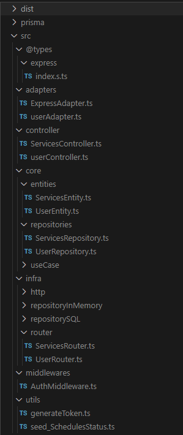

# Requisitos do Sistema de Agendamento de Barbearia

## Entidades:

1. **User (Cliente):**
   - Atributos: ID, nome, e-mail, telefone, senha, data de criação.
  
2. **Service (Serviço):**
   - Atributos: ID, nome, preço, descrição, data de criação, ID do usuário associado.
  
3. **Schedules (Agendamento):**
   - Atributos: ID, data e hora, ID do usuário associado, ID do serviço associado, ID do status do agendamento.
  
4. **SchedulesStatus (Status do Agendamento):**
   - Atributos: ID, nome do status.

## Regras de Negócio:

1. **Horário de Funcionamento:**
   - A barbearia opera dentro de um horário específico. Agendamentos só podem ser feitos dentro desses horários.
   - Os horários de funcionamento podem variar de acordo com o dia da semana ou feriados.

2. **Conflitos de Horário:**
   - Um barbeiro não pode estar agendado para mais de um serviço ao mesmo tempo.
   - Um cliente não pode ter mais de um agendamento no mesmo horário.
   - Os agendamentos devem respeitar o horário de trabalho dos barbeiros e os horários de funcionamento da barbearia.

3. **Cancelamento e Modificação de Agendamento:**
   - Os clientes podem cancelar ou modificar um agendamento com um aviso prévio mínimo (por exemplo, 24 horas).
   - Barbeiros podem ter suas agendas modificadas apenas por administradores.
   - Cancelamentos e modificações de agendamento podem estar sujeitos a taxas ou políticas de reembolso.

4. **Gestão de Serviços:**
   - Os serviços oferecidos devem ser gerenciados pelo administrador do sistema.
   - Os preços e durações dos serviços podem variar.
   - Alterações nos serviços devem refletir nos agendamentos futuros.
   - O tempo de duração do serviço é baseado no serviço escolhido pelo cliente.

5. **Autenticação e Autorização:**
   - Apenas funcionários autorizados podem criar, modificar ou excluir agendamentos.
   - Clientes podem visualizar seus próprios agendamentos, mas não podem modificar a agenda de outros clientes.
   - O sistema deve ter diferentes níveis de acesso, como administrador, funcionário e cliente.

6. **Relatórios e Estatísticas:**
   - O sistema deve ser capaz de gerar relatórios sobre agendamentos, frequência de clientes, serviços mais populares, etc.
   - Relatórios podem ser filtrados por data, barbeiro, serviço, etc.
   - Os relatórios devem ser acessíveis apenas para administradores ou funcionários autorizados.

   ## Estrutura de Pastas do Projeto

   